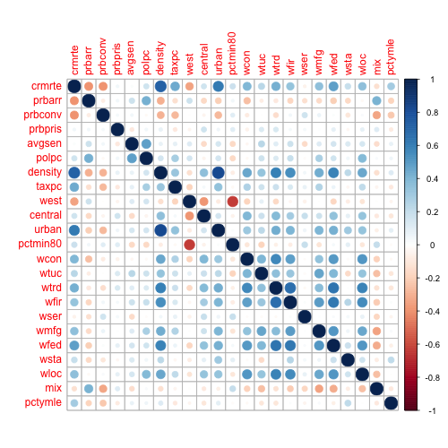
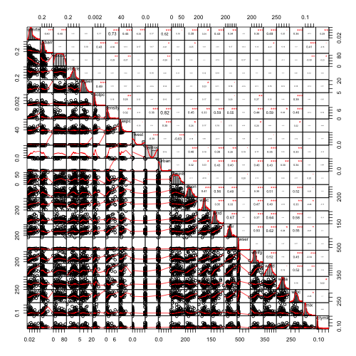
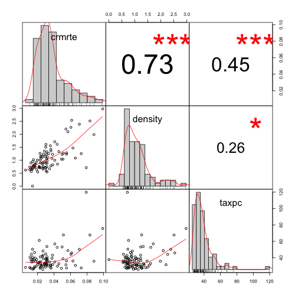
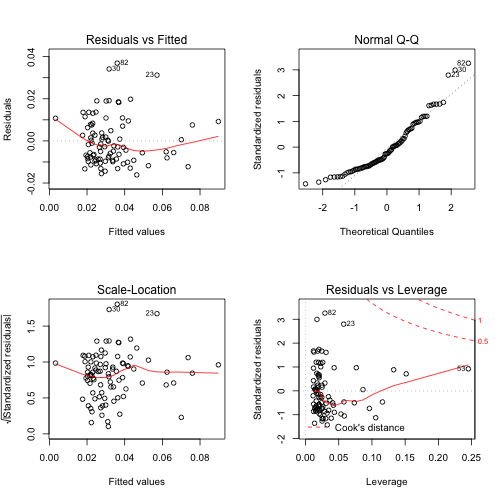
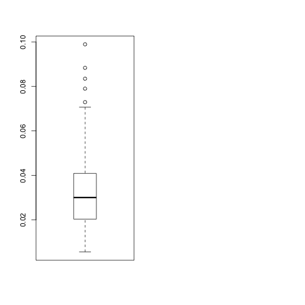
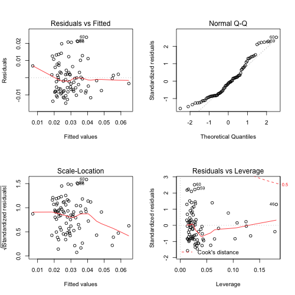
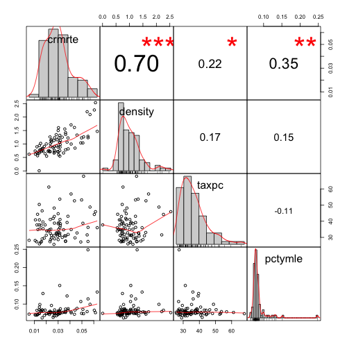
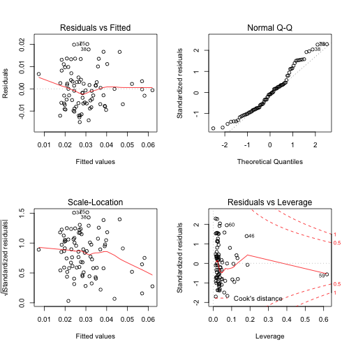

```{r setup, include=FALSE}
knitr::opts_chunk$set(echo = TRUE, tidy.opts=list(width.cutoff=60),tidy=TRUE)
library(car)
library(PerformanceAnalytics)
library(ggplot2)
library(corrplot)
library(dplyr)
library(stargazer)
```

```{r}
crime = read.csv("crime_v2.csv")
```

# Introduction

Here I would like to explore the crime dataset from North Carolina. I will go step by step from statistical standpoint. This is to develop several viable approaches to answer a simple question "Are there any factors that influence the crime in North Carolina?". The dataset has  **`r nrow(crime)`** observations and **`r ncol(crime)`** variables. Our first approach is to investigate each of the variables and how they relate to the occurrence of crimes in North Carolina in 1987. 

# Exploratory Data Analysis

```{r echo=FALSE, include=FALSE}
# Not displaying the output because it's the same as my writeup
ls.str(pat='crime')
```

I listed all variables and their descriptions here. 

| variable | label |
|--------|-------|
| 1 county    | county identifier     |
| 2 year   | 1987     |
| 3 crmrte   | crimes committed per person     |
| 4 prbarr   | 'probability' of arrest     |
| 5 prbconv    | 'probability' of conviction     |
| 6 prbpris   | 'probability' of prison sentence     |
| 7 avgsen   | avg. sentence, days     |
| 8 polpc    | police per capita     |
| 9 density  | people per sq. mile |
| 10 taxpc   | tax revenue per capita |
| 11 west    | =1 if in western N.C. |
| 12 central | =1 if in central N.C. |
| 13 urban   | =1 if in SMSA |
| 14 pctmin80 | perc. minority, 1980 |
| 15 wcon    | weekly wage, construction |
| 16 wtuc    | weekly wage, trns, util, commun |
| 17 wtrd    | weekly wage, whlelse, retail trade |
| 18 wfir    | weekly wage, fin, ins, real est |
| 19 wser    | weekly wage, service industry |
| 20 wmfg    | weekly wage, manufacturing |
| 21 wfed    | weekly wage, fed employees |
| 22 wsta    | weekly wage, state employees |
| 23 wloc    | weekly wage, local gov emps |
| 24 mix     | offense mix: face-to-face/other |
| 25 pctymle | percent young male |

Out of 25 variables, we just set our dependent variable to be **`crime rates, crmrte`** because we believe this reflects the frequency of crimes in North Carolina. To create our prediction model precisely and present clearly, we developed several objectives and lay our foundational work here.  

## Sanity check and data cleaning

There are 97 observations and 25 variables in the dataset. we need to check if there are any empty values in each variable by applying the `!is.na` function. Interestingly, only one variable `prbconv (probability of conviction)` has full observations, i.e., 97. The rest of the variables have 91 observations out of original 97, which gives us **`91/97 = 0.9381`**.
\hfill\break
```{r}
# Margin = 2 indicates column wise application
apply(!is.na(crime), MARGIN=2,  mean)

# We could also try another command `colSums()`
colSums(is.na(crime))
```

```
 county      year    crmrte    prbarr   prbconv   prbpris    avgsen     polpc 
0.9381443 0.9381443 0.9381443 0.9381443 1.0000000 0.9381443 0.9381443 0.9381443 
  density     taxpc      west   central     urban  pctmin80      wcon      wtuc 
0.9381443 0.9381443 0.9381443 0.9381443 0.9381443 0.9381443 0.9381443 0.9381443 
     wtrd      wfir      wser      wmfg      wfed      wsta      wloc       mix 
0.9381443 0.9381443 0.9381443 0.9381443 0.9381443 0.9381443 0.9381443 0.9381443 
  pctymle 
0.9381443 
  county     year   crmrte   prbarr  prbconv  prbpris   avgsen    polpc  density 
       6        6        6        6        0        6        6        6        6 
   taxpc     west  central    urban pctmin80     wcon     wtuc     wtrd     wfir 
       6        6        6        6        6        6        6        6        6 
    wser     wmfg     wfed     wsta     wloc      mix  pctymle 
       6        6        6        6        6        6        6 
 ```


We also need to check if all 97 observations in `prbconv` is a real value or any of the special characters. As a control, we included other variables as well.


```{r}
# Checking special characters such as 'a white space' etc 
(apply(crime[1:25], MARGIN=2, FUN=function(x) sum(x %in% c("`", "", "?", "!", "@", "#", "$", "%", "^", "&", "*", "(", ")"))))
```

```
  county     year   crmrte   prbarr  prbconv  prbpris   avgsen    polpc  density 
       0        0        0        0        6        0        0        0        0 
   taxpc     west  central    urban pctmin80     wcon     wtuc     wtrd     wfir 
       0        0        0        0        0        0        0        0        0 
    wser     wmfg     wfed     wsta     wloc      mix  pctymle 
       0        0        0        0        0        0        0 
```

As you can see, we found that there are **`6`** special characters in `prbconv` variable, which left me with 91 observations from 97. The rest of the variables do not contain special characters. Further check upon `prbconv` shows that the variable contains **`5`** white space and a special character `backtick`, **`**. 

Before we continue the analysis, I removed all empty rows. I also checked if there is any duplicate observations in our sample by `distinct()` function. Since there are variables with probability, I removed any samples with probability greater than 1 or percentage greater than 100 to avoid erroraneous recordings in crime data, which led to remove one additional row that has a `prbarr` greater than 1. The data now has 90 rows. Lastly, I changed the variable type into `numeric` for developing our model. 

```{r}
# So 97 observations end up at 91 observations. 
crime_full = crime[complete.cases(crime), ]

# Removing duplicate samples in the dataset
crime_unique = distinct(crime_full)

# Changing the data type into 'numeric' for our data analysis
crime_num= as.data.frame(lapply(crime_unique, as.numeric))

# Remove probability or percentage greater than 1 or 100 in prbarr, prbconv, prbpris, pctmin80, pctymle to make it sensible data
crime_cleaned = crime_num[!(crime_num$prbarr > 1 & crime_num$prbconv > 100 &  crime_num$prbpris > 1 & crime_num$pctmin80 > 100 & crime_num$pctymle > 1),]
```

# Independent Variables or Explanatory Variables analysis

I checked if there's any relationship between each explanatory variable by correlation matrix by `cor()` function. To visualize the correlation matrix, I use the corrplot on the results from the `cor()` function. I also checked by histogram and correlation numbers by `chart.Correlation()` function from `PerformanceAnalytics` library. 

I removed `year` and `county` in my explanatory variable because `year` is 1987 and `county` is all ordinal number. 

```{r}
png("corrplot.png", width = 500, height = 500)
corrplot(cor(crime_cleaned[3:25]))
```

<p align="center">
</p>
<p align="center">Figure 1. Correlation plot in Heat Map</p>

```{r}
png("corrmatrix.png", width = 500, height = 500)
chart.Correlation(crime_cleaned[3:25], histogram = TRUE, pch=19)
```
<p align="center">
</p>
<p align="center">Figure 2. Correlation Matirx with Histogram and ScatterPlot</p>

## Positive Correlation 

I found the high correlation on `crmrte` from ten explanatory variables. 

- `density` = 0.73 
- `urban` = 0.62 
- `taxpc` = 0.45
- `wcon` = 0.39 
- `wtrd` = 0.43 
- `wfir` = 0.34 
- `wfmg` = 0.35 
- `wfed` = 0.49 
- `wloc` = 0.36 
- `pctymle` = 0.29 

Intuitively, we can imagine that `density` and `urban` might be correlated because urban area will be higly populated. Evidently `density` and `urban` has `0.82` correlation, which gives us an insight when we develop our prediction model. 

I also observed that `density` has a high correlation with `wcon`, `wtrd`, `wfir`, `wfmg`, `wfed` and `wloc` with `0.45`, `0.59`, `0.55`, `0.44`, `0.59`, `0.46` respectively. It appears that weekly wages of those amenities such as transportation, manufacturing sector, federal employess are also highly correlated with `density` or `urban` explanatory variable. This also makes sense because highly populated area will have more industrial servivces, accounting for `wages` explanatory variables. 

Another interesting finding from such a correlation matrix is `pctymle`, a percent of young male population is not correlated with all the other variables we listed previously. Therefore we can keep an eye on this explanatory variable.  

## Negative Correlation

We also found that there are some variables negatively correlated to our dependent variable `crmrte`. 

- `prbarr`= -0.40 
- `prbconv` = -0.40 
- `west` = -0.35 

Negative relationship between each explanatory variable: 

- `west` and `pctmin80` = -0.63 

# Selection of Key variables

Out of 25 variables, in order to understand the `key determinants` of the crime, we first need to define our two **Key independent variables** to be 

- `density` people per sq.mile 
- `taxpc` tax per capita 

For developing a more accurate model gradually, here is a list of the variable that I will test out sequentially with more clear explantion on classical regression.  

- `polpc` police per capita 
- `pctmin80` percent of minority 
- `pctymle` percent of young male population 

## Correlation matrix between 3 variables (dependent and independents)

```{r}
png("table1.png", width = 500, height = 500)
table1 = cbind(crime_cleaned[3], sqrt(crime_cleaned[9]), crime_cleaned[10])
chart.Correlation(table1, histogram = TRUE, pch=19)
```
<p align="center">
</p>
<p align="center">Figure 3. Correlation Matrix with two explanatory variables</p>

# Model 1
```{r}
# Since there's an outlier in taxpc at 120, we remove the extreme outlier
crime_89 = crime_cleaned[!(crime_cleaned$taxpc > 100),]

model1 = lm(crmrte ~ sqrt(density) + taxpc, data=crime_89)
summary(model1)
```
```
Call:
lm(formula = crmrte ~ sqrt(density) + taxpc, data = crime_89)

Residuals:
      Min        1Q    Median        3Q       Max 
-0.016150 -0.008611 -0.002867  0.007539  0.036917 

Coefficients:
                Estimate Std. Error t value Pr(>|t|)    
(Intercept)   -0.0021107  0.0048579  -0.434    0.665    
sqrt(density)  0.0273720  0.0026733  10.239   <2e-16 ***
taxpc          0.0001392  0.0001365   1.020    0.311    
---
Signif. codes:  0 ‘***’ 0.001 ‘**’ 0.01 ‘*’ 0.05 ‘.’ 0.1 ‘ ’ 1

Residual standard error: 0.01151 on 86 degrees of freedom
Multiple R-squared:  0.6161,	Adjusted R-squared:  0.6072 
F-statistic: 69.01 on 2 and 86 DF,  p-value: < 2.2e-16
```

```{r}
png("model1.png", width = 500, height = 500)
par(mfrow=c(2,2))
plot(model1)
```
<p align="center">
</p>
<p align="center">Figure 4. The first base model 1</p>

# Checking the violation of assumptions in classical linear regression

## Assumpion I : Expected or sum of the error term is equal to zero. 

$E(\epsilon) = 0$ or $\sum \epsilon = 0$
```{r}
mean(model1$residuals)
sum(model1$residuals)
```

```
[1] -2.018413e-19
[1] -1.799776e-17
```

Since the expected value of residuals or sum is infinitesimally small, our assumption is satisfied. But we do not know if our model also satisifes other assumptions. I will explore more from the 4 plots above. 

The first model shows that our residuals are clustered based on the first plot `Residuals Vs Fitted`. QQ plot also shows that the residuals are not normally distributed and there are a few observations such as an observation `25` has a high influence or leverage on our regression model as it goes beyond the Cook's distance. This can also be seen in our prior scatterplot in which we can see that there are a few outliers in `pctymle` variable. As a practice, I continue checking all other assumptions before we modify our base model. 

### Pearson's correlation 

```{r}
# Checking the assumption in OLS
# Checking if there's any correlation between independent variable and the residuals
cor.test(sqrt(crime_89$density), model1$residuals)
cor.test(crime_89$taxpc, model1$residuals)
```

```
	Pearson's product-moment correlation

data:  sqrt(crime_89$density) and model1$residuals
t = 2.6664e-16, df = 87, p-value = 1
alternative hypothesis: true correlation is not equal to 0
95 percent confidence interval:
 -0.2082567  0.2082567
sample estimates:
        cor 
2.85868e-17 


	Pearson's product-moment correlation

data:  crime_89$taxpc and model1$residuals
t = 6.0595e-17, df = 87, p-value = 1
alternative hypothesis: true correlation is not equal to 0
95 percent confidence interval:
 -0.2082567  0.2082567
sample estimates:
        cor 
6.49645e-18 
```
The correlation test shows that there is no correlation between our explanatory variables and the dependent variable: `crmrte`. Their p-value is 1 and 1 respectively. So we fail to reject our null hypothesis which is no correlation between the explanatory variables and the dependent variable. 

## Assumption 2 : Homoscedasticity 

```{r}
var(sqrt(crime_cleaned$density))
var(crime_cleaned$taxpc)
```

```
[1] 0.2524518
[1] 171.9203
```
We also see that the variance of the explanatory variable `sqrt(density)` has low variance, which satisfies our homoscedasticity. However the variance of the other variable `pctymle` is high, further confirming our previous observation that there are a few outliers in `pctymle` variable. 

## Assumption 3 : No Multicollinearity between explanatory variables

```{r}
vif(model1)
```

```
sqrt(density)         taxpc 
     1.205425      1.205425 
```

As a general rule of thumb, VIF (Variance Inflation Factor) should be lower than 4. The higher the VIF, the more correlation between each explanatory variables. As I mentioned earlier on, we started off with a selection of variables that do not have a correlation between each other. So our `vif()` test again confirms our choice here and satisfies our assumption. 

## Assumption 4 : Skewness, Kurtosis

```{r}
library(gvlma)
gvlma(model1)
```

```
Call:
lm(formula = crmrte ~ sqrt(density) + taxpc, data = crime_89)

Coefficients:
  (Intercept)  sqrt(density)          taxpc  
   -0.0021107      0.0273720      0.0001392  


ASSESSMENT OF THE LINEAR MODEL ASSUMPTIONS
USING THE GLOBAL TEST ON 4 DEGREES-OF-FREEDOM:
Level of Significance =  0.05 

Call:
 gvlma(x = model1) 
 ```
 
| Assumption | Value | p-value | Decision |
|--------------------|--------------:|-------------:|---------------------------:|
|Global Stat	| 20.8513239	| 3.389018e-04	| Assumptions NOT satisfied! |
|Skewness	| 17.0464288	| 3.647691e-05	|Assumptions NOT satisfied! |
|Kurtosis	| 2.9969395	| 8.342197e-02	| Assumptions acceptable. |
|Link Function	| 0.5555872	| 4.560437e-01	| Assumptions acceptable. |
|Heteroscedasticity	| 0.2523685	| 6.154123e-01	|Assumptions acceptable. |


We see that there are a few assumptions violated in our model, presumably due to the choice of our explanatory variable in the beginning. 

## More Data Cleaning

```{r}
# Checking if there's any outliers
png("boxplot1.png", width = 500, height = 500)
par(mfrow=c(1,2))
boxout = boxplot(crime_cleaned$crmrte, varwidth = T, outline = T, border = T, plot = T, boxwex = .25)
boxout$out
```
<p align="center">
</p>
<p align="center">Figure 5. Boxplot and outliers</p>

```
0.0883849 0.0790163 0.0989659 0.0834982 0.0729479
```

Boxplot shows that there are 5 outliers in crmrte that would have influenced our regression model. 

# Model 2

```{r}
# Using boxplot.stats remove the printout. boxplot() can also be used. 
png("model2.png", width = 500, height = 500)
crime_83 = crime_89[!(crime_89$crmrte %in% boxplot.stats(crime_89$crmrte)$out),]
model2 = lm(crmrte ~ sqrt(density) + taxpc, data=crime_83)
par(mfrow=c(2,2))
plot(model2)
```
<p align="center">
</p>
<p align="center">Figure 6. Model 2 with outliers removed</p>

You now notice that after removing 5 outliers, there's no observations closer to Cook's distance. This will reduces biases in our regression model. 

## Assumption 5 : Omitted Variable Bias

Since we used `density`, another assumption in classical linear regression is **Omitted Variable Bias**. Density also reflects a population. Out of 24 explanatory variable, I have `pctymle`, percent of young male population which has no correlation with `density`. So we can introduce new variable. 

```{r}
png("table2.png", width = 500, height = 500)
table2 = cbind(crime_83[3], sqrt(crime_83[9]), crime_83[10], crime_83[25])
chart.Correlation(table2, histogram = TRUE, pch=19)
```

<p align="center">
</p>
<p align="center">Figure 7. Correlation Matrix with 3 explanatory variables</p>

# Model 3

```{r}
png("model3.png", width = 500, height = 500)
model3 = lm(crmrte ~ sqrt(density) + taxpc + pctymle, data=crime_83)
summary(model3)
par(mfrow=c(2,2))
plot(model3)
```
```
Call:
lm(formula = crmrte ~ sqrt(density) + taxpc + pctymle, data = crime_83)

Residuals:
       Min         1Q     Median         3Q        Max 
-0.0149544 -0.0067494 -0.0006957  0.0040228  0.0201478 

Coefficients:
                Estimate Std. Error t value Pr(>|t|)    
(Intercept)   -0.0128792  0.0059792  -2.154 0.034287 *  
sqrt(density)  0.0207617  0.0024374   8.518 8.51e-13 ***
taxpc          0.0002299  0.0001188   1.934 0.056641 .  
pctymle        0.1532323  0.0424431   3.610 0.000535 ***
---
Signif. codes:  0 ‘***’ 0.001 ‘**’ 0.01 ‘*’ 0.05 ‘.’ 0.1 ‘ ’ 1

Residual standard error: 0.008849 on 79 degrees of freedom
Multiple R-squared:  0.5771,	Adjusted R-squared:  0.5611 
F-statistic: 35.94 on 3 and 79 DF,  p-value: 9.418e-15
```

<p align="center">
</p>
<p align="center">Figure 8. Essential plots for Model 3</p>

You would notice that the distribution of residuals become normal in 1st plot. Scale-location plot also shows a homoscedasticity of the residual variance. There is one observation `30` lying closer to Cook's distance. This sample is also an outlier in `QQ plot`.  

# Model 4
## Adding 3 dummy variables `west`, `central` and `urban`

```{r}
# Remove the outlier by the boxplot
crime_81 = crime_83[!(crime_83$crmrte %in% boxplot.stats(crime_83$crmrte)$out),]

# Adding dummy variables
model4 = lm(crmrte ~ sqrt(density) + taxpc + pctymle + factor(west) + factor(central) + factor(urban), data=crime_81)


summary(model4)
par(mfrow=c(2,2))
png("model4.png", width = 500, height = 500)
plot(model4)

gvlma(model4)
```

```
Residual standard error: 0.007815 on 74 degrees of freedom
Multiple R-squared:  0.6371,	Adjusted R-squared:  0.6077 
F-statistic: 21.65 on 6 and 74 DF,  p-value: 1.593e-14


Call:
lm(formula = crmrte ~ sqrt(density) + taxpc + pctymle + factor(west) + 
    factor(central) + factor(urban), data = crime_81)

Coefficients:
     (Intercept)     sqrt(density)             taxpc           pctymle  
      -0.0016371         0.0223412         0.0001208         0.1034380  
   factor(west)1  factor(central)1    factor(urban)1  
      -0.0100001        -0.0065651         0.0039072  


ASSESSMENT OF THE LINEAR MODEL ASSUMPTIONS
USING THE GLOBAL TEST ON 4 DEGREES-OF-FREEDOM:
Level of Significance =  0.05 

Call:
 gvlma(x = model4) 
 ```

| Assumption | Value | p-value | Decision |
|--------------------|--------------:|-------------:|---------------------------:|
|Global Stat	| 2.75871150	| 0.5989806	| Assumptions acceptable. |
|Skewness	| 1.97484766	| 0.1599342	|Assumptions acceptable. |
|Kurtosis	| 0.05326972	| 0.8174684	| Assumptions acceptable. |
|Link Function	| 0.64766157	| 0.4209500	| Assumptions acceptable. |
|Heteroscedasticity	| 0.08293255	| 0.7733620	|Assumptions acceptable. |

We observed that our model becomes more in tune with classical assumptions for linear regression. 

# Model 5

```{r}
# Adding one more explanatory variable
png("model5.png", width = 500, height = 500)
model5 = lm(crmrte ~ sqrt(density) + taxpc + pctymle + pctmin80 + factor(west) + factor(central) + factor(urban), data=crime_81)

summary(model5)
par(mfrow=c(2,2))
plot(model5)

gvlma(model5)
```

```
Call:
lm(formula = crmrte ~ sqrt(density) + taxpc + pctymle + pctmin80 + 
    factor(west) + factor(central) + factor(urban), data = crime_81)

Residuals:
       Min         1Q     Median         3Q        Max 
-0.0143574 -0.0049366 -0.0008309  0.0045232  0.0177253 

Coefficients:
                   Estimate Std. Error t value Pr(>|t|)    
(Intercept)      -1.264e-02  7.217e-03  -1.751  0.08414 .  
sqrt(density)     2.462e-02  3.065e-03   8.031 1.23e-11 ***
taxpc             1.333e-04  1.069e-04   1.247  0.21637    
pctymle           1.126e-01  3.853e-02   2.923  0.00461 ** 
pctmin80          2.010e-04  7.744e-05   2.595  0.01141 *  
factor(west)1    -3.721e-03  3.212e-03  -1.158  0.25052    
factor(central)1 -4.235e-03  2.337e-03  -1.812  0.07411 .  
factor(urban)1    1.358e-03  5.510e-03   0.246  0.80602    
---
Signif. codes:  0 ‘***’ 0.001 ‘**’ 0.01 ‘*’ 0.05 ‘.’ 0.1 ‘ ’ 1

Residual standard error: 0.007529 on 73 degrees of freedom
Multiple R-squared:  0.6678,	Adjusted R-squared:  0.6359 
F-statistic: 20.96 on 7 and 73 DF,  p-value: 3.49e-15


Call:
lm(formula = crmrte ~ sqrt(density) + taxpc + pctymle + pctmin80 + 
    factor(west) + factor(central) + factor(urban), data = crime_81)

Coefficients:
     (Intercept)     sqrt(density)             taxpc           pctymle  
      -0.0126379         0.0246194         0.0001333         0.1126188  
        pctmin80     factor(west)1  factor(central)1    factor(urban)1  
       0.0002010        -0.0037209        -0.0042347         0.0013581  


ASSESSMENT OF THE LINEAR MODEL ASSUMPTIONS
USING THE GLOBAL TEST ON 4 DEGREES-OF-FREEDOM:
Level of Significance =  0.05 

Call:
 gvlma(x = model5)
 ```
 
```
Global Stat	2.5446103	0.6366658	Assumptions acceptable.	
Skewness	0.9625682	0.3265407	Assumptions acceptable.	
Kurtosis	0.2539941	0.6142766	Assumptions acceptable.	
Link Function	0.3476697	0.5554353	Assumptions acceptable.	
Heteroscedasticity	0.9803783	0.3221054	Assumptions acceptable.
```
	
# Model 6

```{r}
# Adding one more explanatory variable
png("model6.png", width = 500, height = 500)
model6 = lm(crmrte ~ prbarr + prbconv + polpc + sqrt(density) + taxpc + pctymle + pctmin80 + factor(west) + factor(central) + factor(urban), data=crime_81)

summary(model6)
par(mfrow=c(2,2))
plot(model5)

gvlma(model6)
```

```
F-statistic:  17.7 on 10 and 70 DF,  p-value: 1.548e-15


Call:
lm(formula = crmrte ~ prbarr + prbconv + polpc + sqrt(density) + 
    taxpc + pctymle + pctmin80 + factor(west) + factor(central) + 
    factor(urban), data = crime_81)

Coefficients:
     (Intercept)            prbarr           prbconv             polpc  
       7.519e-03        -2.479e-02        -1.131e-04         2.342e+00  
   sqrt(density)             taxpc           pctymle          pctmin80  
       2.140e-02        -1.683e-06         6.353e-02         2.543e-04  
   factor(west)1  factor(central)1    factor(urban)1  
      -3.421e-03        -3.934e-03         3.562e-04  


ASSESSMENT OF THE LINEAR MODEL ASSUMPTIONS
USING THE GLOBAL TEST ON 4 DEGREES-OF-FREEDOM:
Level of Significance =  0.05 

Call:
 gvlma(x = model6) 
 ```
 ```
Global Stat	1.9030325	0.7535879	Assumptions acceptable.	
Skewness	0.1105759	0.7394894	Assumptions acceptable.	
Kurtosis	0.5279075	0.4674879	Assumptions acceptable.	
Link Function	0.1247535	0.7239351	Assumptions acceptable.	
Heteroscedasticity	1.1397956	0.2856955	Assumptions acceptable.	
```

# Akaike Test : Goodness of Fit Vs Parsimony 

As you know by now, we explored a number of explanatory variables in our prediction model. But as we add more variables, $R^2$ also increases but it does not mean that our model becomes better. We need to check other assumptions such as residuals, homoscedasticity and such. One of the test to check the parsimony model is Akaike test, AIC(). 

```{r}
AIC(model1)
AIC(model2)
AIC(model3)
AIC(model4)
AIC(model5)
AIC(model6)
```

```
[1] -537.2417
[1] -532.6429
[1] -543.3181
[1] -547.4314
[1] -552.581
[1] -559.4527
```

You now realize that our last model gives us the better AIC value while we are not employing all the variables available in our data. 

```{r}
stargazer(model1, model2, model3, model4, model5, model6, type = "text", 
          report = "vc", # Don't report errors, since we haven't covered them
          title = "Linear Models Predicting Crime Rates in NC",
          keep.stat = c("rsq", "adj.rsq", "n"),
          omit.table.layout = "n") # Omit more output related to errors
```

```
Linear Models Predicting Crime Rates in NC
============================================================
                             Dependent variable:            
                 -------------------------------------------
                                   crmrte                   
                  (1)    (2)    (3)    (4)    (5)     (6)   
------------------------------------------------------------
prbarr                                               -0.025 
                                                            
prbconv                                             -0.0001 
                                                            
polpc                                                2.342  
                                                            
sqrt(density)    0.027  0.022  0.021  0.022  0.025   0.021  
                                                            
taxpc            0.0001 0.0002 0.0002 0.0001 0.0001 -0.00000
                                                            
pctymle                        0.153  0.103  0.113   0.064  
                                                            
pctmin80                                     0.0002  0.0003 
                                                            
factor(west)1                         -0.010 -0.004  -0.003 
                                                            
factor(central)1                      -0.007 -0.004  -0.004 
                                                            
factor(urban)1                        0.004  0.001   0.0004 
                                                            
Constant         -0.002 0.001  -0.013 -0.002 -0.013  0.008  
                                                            
------------------------------------------------------------
Observations       89     83     83     81     81      81   
R2               0.616  0.507  0.577  0.637  0.668   0.717  
Adjusted R2      0.607  0.495  0.561  0.608  0.636   0.676  
============================================================
```

# Testing Model 5 (Optional Learning)

$\widehat{\text{crmrte}} = \beta_0 + \beta_1 \cdot \text{sqrt(density)} + \beta_2 \cdot \text{taxpc} + \beta_3 \cdot \text{pctymle} + \beta_4 \cdot \text{pctmin80} + \beta_5 \cdot \text{west} + \beta_6 \cdot \text{central} + \beta_7 \cdot \text{urban}$  

Where `west`, `central` and `urban` are dummy variables. 

$\widehat{\text{crmrte}} = -0.013 + 0.025 \cdot \text{sqrt(density)} + 0.0001 \cdot \text{taxpc} + 0.113 \cdot \text{pctymle} + 0.0002 \cdot \text{pctmin80} - 0.004 \cdot \text{west} - 0.004 \cdot \text{central} + 0.001 \cdot \text{urban}$  

```{r}
# define the sample size for train and test split
d = sample(x = nrow(crime_81), size=nrow(crime_81)*0.7)
# Splitting into train and test dataset by the d percentage which is 0.7
train = crime_81[d,]
test = crime_81[-d,]
# Train model
model2 = lm(crmrte ~ sqrt(density) + taxpc, data=train)
model3 = lm(crmrte ~ sqrt(density) + taxpc + pctymle, data=train)
model4 = lm(crmrte ~ sqrt(density) + taxpc + pctymle + factor(west) + factor(central) + factor(urban), data=train)
model5 = lm(crmrte ~ sqrt(density) + taxpc + pctymle + pctmin80 + factor(west) + factor(central) + factor(urban), data=train)
model6 = lm(crmrte ~ prbarr + prbconv + polpc + sqrt(density) + taxpc + pctymle + pctmin80 + factor(west) + factor(central) + factor(urban), data=train)

# test model
prediction2 = predict(model2, test)
prediction3 = predict(model3, test)
prediction4 = predict(model4, test)
prediction5 = predict(model5, test)
prediction6 = predict(model6, test)

# Checking the accuracy of the prediction model by test data on the regression line
library(Metrics)
rmse(actual = crime_81$crmrte, predicted = prediction2)
rmse(actual = crime_81$crmrte, predicted = prediction3)
rmse(actual = crime_81$crmrte, predicted = prediction4)
rmse(actual = crime_81$crmrte, predicted = prediction5)
rmse(actual = crime_81$crmrte, predicted = prediction6)
```

# Conclusion

Statisically we proved that the crime rate in North Carolina is highly correlated with the density. We also showed that depending on the location, crime events vary across the regions: `west`, `central` and `urban`. By using our location variables as the dummy variables, we fine-tuned our model. We have statistically indicated the key determinants in investigating the crime in North Carolina. 
